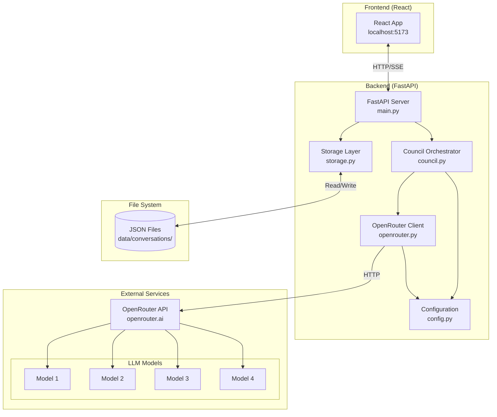
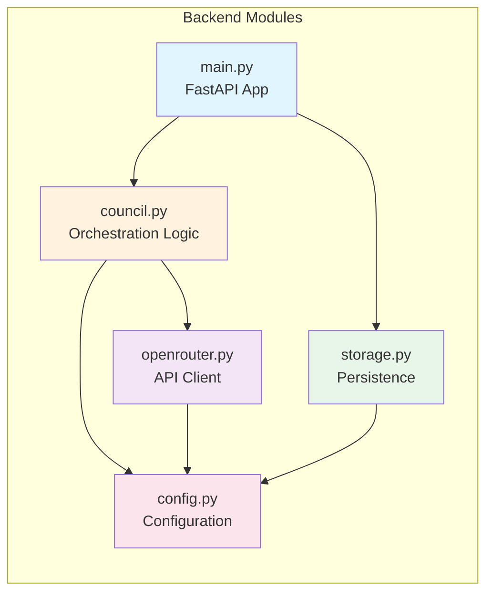
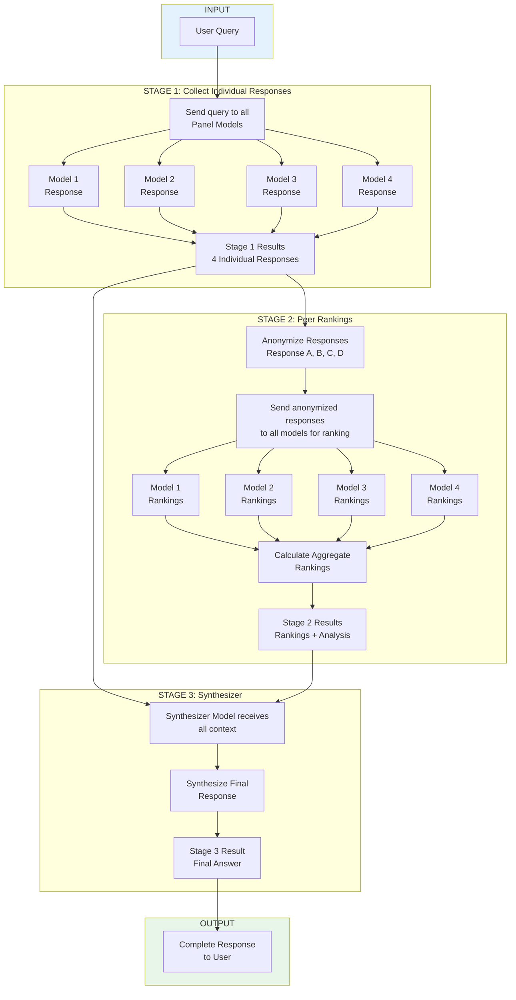
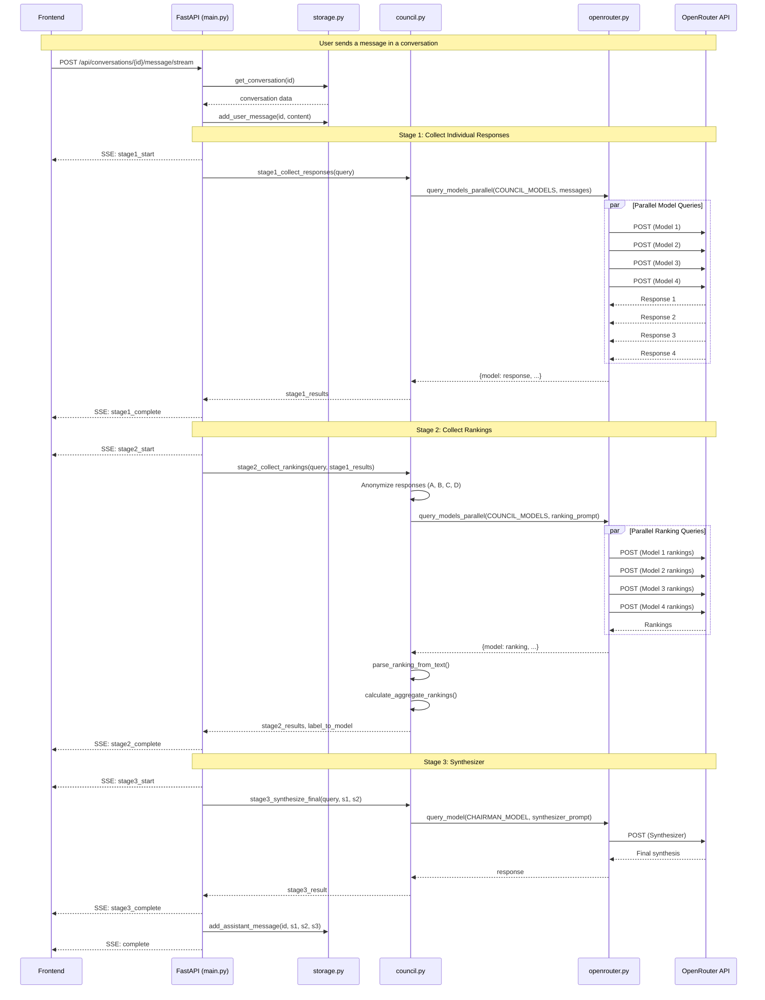
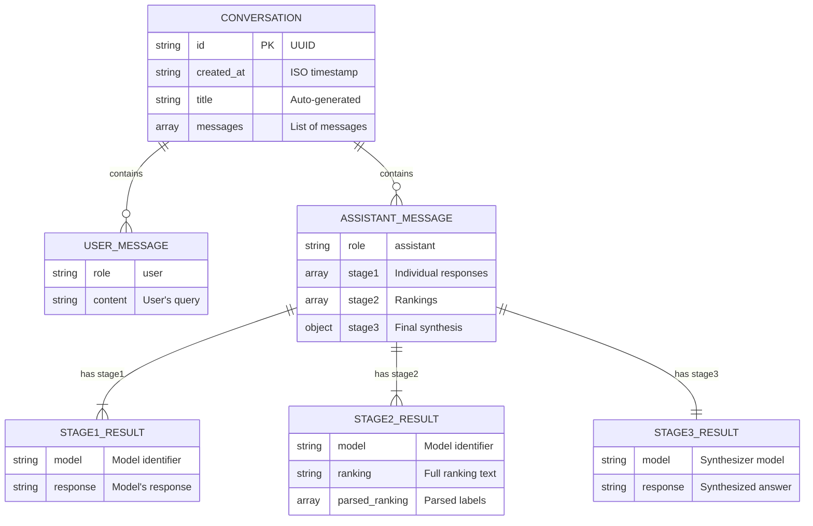
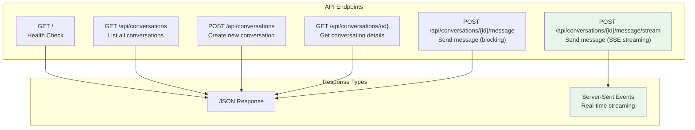

# AI Peer Review - Architecture & Design

This document provides comprehensive technical documentation including architecture diagrams, implementation details, and development notes.

---

## Project Overview

AI Peer Review is a 3-stage deliberation system where multiple LLMs collaboratively answer user questions. The key innovation is anonymized peer review in Stage 2, preventing models from playing favorites.

---

## 1. System Architecture Overview



---

## 2. Module Dependency Diagram



---

## 3. The 3-Stage Process



---

## 4. Backend Module Details

### `config.py`
- Contains `COUNCIL_MODELS` (list of OpenRouter model identifiers)
- Contains `CHAIRMAN_MODEL` (model that synthesizes final answer)
- Uses environment variable `OPENROUTER_API_KEY` from `.env`
- Backend runs on **port 8001**

### `openrouter.py`
- `query_model()`: Single async model query
- `query_models_parallel()`: Parallel queries using `asyncio.gather()`
- Returns dict with 'content' and optional 'reasoning_details'
- Graceful degradation: returns None on failure, continues with successful responses

### `council.py` - The Core Logic
- `stage1_collect_responses()`: Parallel queries to all panel models
- `stage2_collect_rankings()`:
  - Anonymizes responses as "Response A, B, C, etc."
  - Creates `label_to_model` mapping for de-anonymization
  - Prompts models to evaluate and rank (with strict format requirements)
  - Returns tuple: (rankings_list, label_to_model_dict)
  - Each ranking includes both raw text and `parsed_ranking` list
- `stage3_synthesize_final()`: Synthesizer compiles from all responses + rankings
- `parse_ranking_from_text()`: Extracts "FINAL RANKING:" section
- `calculate_aggregate_rankings()`: Computes average rank position across all peer evaluations

### `storage.py`
- JSON-based conversation storage in `data/conversations/`
- Each conversation: `{id, created_at, messages[]}`
- Assistant messages contain: `{role, stage1, stage2, stage3}`
- Note: metadata (label_to_model, aggregate_rankings) is NOT persisted to storage

### `main.py`
- FastAPI app with CORS enabled
- POST `/api/conversations/{id}/message` returns metadata in addition to stages
- Metadata includes: label_to_model mapping and aggregate_rankings

---

## 5. API Request Sequence



---

## 6. Data Models



---

## 7. REST API Endpoints



---

## 8. SSE Event Flow

```mermaid
stateDiagram-v2
    [*] --> stage1_start: Request received
    stage1_start --> stage1_complete: Models respond
    stage1_complete --> stage2_start: Begin rankings
    stage2_start --> stage2_complete: Rankings collected
    stage2_complete --> stage3_start: Begin synthesis
    stage3_start --> stage3_complete: Synthesizer responds
    stage3_complete --> title_complete: (if first message)
    stage3_complete --> complete: (if not first)
    title_complete --> complete: Title generated
    complete --> [*]: Stream ends

    note right of stage1_start: {"type": "stage1_start"}
    note right of stage1_complete: {"type": "stage1_complete", "data": [...]}
    note right of stage2_complete: {"type": "stage2_complete", "data": [...], "metadata": {...}}
    note right of stage3_complete: {"type": "stage3_complete", "data": {...}}
```

---

## 9. Frontend Structure

### `App.jsx`
- Main orchestration: manages conversations list and current conversation
- Handles message sending and metadata storage
- Important: metadata is stored in the UI state for display but not persisted to backend JSON

### `components/ChatInterface.jsx`
- Multiline textarea (3 rows, resizable)
- Enter to send, Shift+Enter for new line
- User messages wrapped in markdown-content class for padding

### `components/Stage1.jsx`
- Tab view of individual model responses
- ReactMarkdown rendering with markdown-content wrapper

### `components/Stage2.jsx`
- **Critical Feature**: Tab view showing RAW evaluation text from each model
- De-anonymization happens CLIENT-SIDE for display (models receive anonymous labels)
- Shows "Extracted Ranking" below each evaluation so users can validate parsing
- Aggregate rankings shown with average position and vote count

### `components/Stage3.jsx`
- Final synthesized answer from synthesizer model
- Green-tinted background to highlight conclusion

### Styling
- Light mode theme with warm amber accent color (#d97706)
- Uses CSS variables for theming
- DM Sans font for UI, JetBrains Mono for code
- Global markdown styling in `index.css`

---

## 10. Key Design Decisions

### Stage 2 Prompt Format
The Stage 2 prompt is very specific to ensure parseable output:
```
1. Evaluate each response individually first
2. Provide "FINAL RANKING:" header
3. Numbered list format: "1. Response C", "2. Response A", etc.
4. No additional text after ranking section
```

### De-anonymization Strategy
- Models receive: "Response A", "Response B", etc.
- Backend creates mapping: `{"Response A": "openai/gpt-4o", ...}`
- Frontend displays model names in **bold** for readability
- Users see explanation that original evaluation used anonymous labels
- This prevents bias while maintaining transparency

### Error Handling Philosophy
- Continue with successful responses if some models fail (graceful degradation)
- Never fail the entire request due to single model failure
- Log errors but don't expose to user unless all models fail

### UI/UX Transparency
- All raw outputs are inspectable via tabs
- Parsed rankings shown below raw text for validation
- Users can verify system's interpretation of model outputs

---

## 11. Design Patterns

| Pattern | Usage | Location |
|---------|-------|----------|
| **Async/Await** | Non-blocking I/O for API calls | `openrouter.py`, `council.py` |
| **Parallel Processing** | `asyncio.gather` for concurrent model queries | `openrouter.query_models_parallel()` |
| **Server-Sent Events** | Real-time streaming updates | `main.py` streaming endpoint |
| **Repository Pattern** | JSON file-based storage abstraction | `storage.py` |
| **Configuration Injection** | Centralized config via module | `config.py` |
| **Event-Driven Updates** | SSE events for each stage completion | `main.py` event generator |

---

## 12. Common Gotchas

1. **Module Import Errors**: Always run backend as `python -m backend.main` from project root
2. **CORS Issues**: Frontend must match allowed origins in `main.py` CORS middleware
3. **Ranking Parse Failures**: If models don't follow format, fallback regex extracts any "Response X" patterns
4. **Missing Metadata**: Metadata is ephemeral (not persisted), only available in API responses

---

## 13. Port Configuration

- Backend: 8001
- Frontend: 5173 (Vite default)
- Update both `backend/main.py` and `frontend/src/api.js` if changing

---

## 14. File Summary

| File | Purpose | Lines |
|------|---------|-------|
| `main.py` | FastAPI application, REST endpoints, CORS | ~200 |
| `council.py` | 3-stage orchestration logic | ~336 |
| `openrouter.py` | HTTP client for OpenRouter API | ~80 |
| `storage.py` | JSON file persistence | ~173 |
| `config.py` | Environment and model configuration | ~27 |

---

## Data Flow Summary

```
User Query
    ↓
Stage 1: Parallel queries → [individual responses]
    ↓
Stage 2: Anonymize → Parallel ranking queries → [evaluations + parsed rankings]
    ↓
Aggregate Rankings Calculation → [sorted by avg position]
    ↓
Stage 3: Synthesizer compilation with full context
    ↓
Return: {stage1, stage2, stage3, metadata}
    ↓
Frontend: Display with tabs + validation UI
```

The entire flow is async/parallel where possible to minimize latency.

